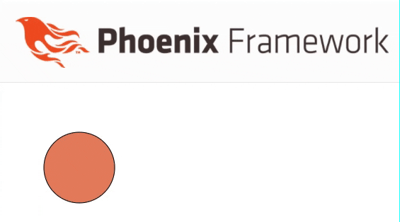

## Description

This little project demonstrates how to interact with [D3.js](https://d3js.org/) from a Phoenix LiveView using [client hooks](https://hexdocs.pm/phoenix_live_view/js-interop.html#client-hooks).

Currently a simple circle object is added to the LiveView dynamically. The color of the circle changes by periodically pushing a random color to the client.



More examples might be added in the future.

## How the project was created:

```sh
mix phx.new phoenix_liveview_d3js --no-mailer --no-dashboard --no-ecto --live --module D3Demo

cd phoenix_liveview_d3js/assets

npm install d3 --save
```

To start your Phoenix server:

  * Install dependencies with `mix deps.get`
  * Start Phoenix endpoint with `mix phx.server` or inside IEx with `iex -S mix phx.server`

Now you can visit [`localhost:4000`](http://localhost:4000) from your browser.

Ready to run in production? Please [check our deployment guides](https://hexdocs.pm/phoenix/deployment.html).

## Learn more

  * Official website: https://www.phoenixframework.org/
  * Guides: https://hexdocs.pm/phoenix/overview.html
  * Docs: https://hexdocs.pm/phoenix
  * Forum: https://elixirforum.com/c/phoenix-forum
  * Source: https://github.com/phoenixframework/phoenix
